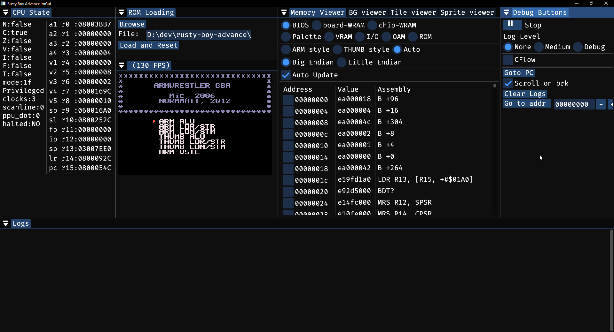
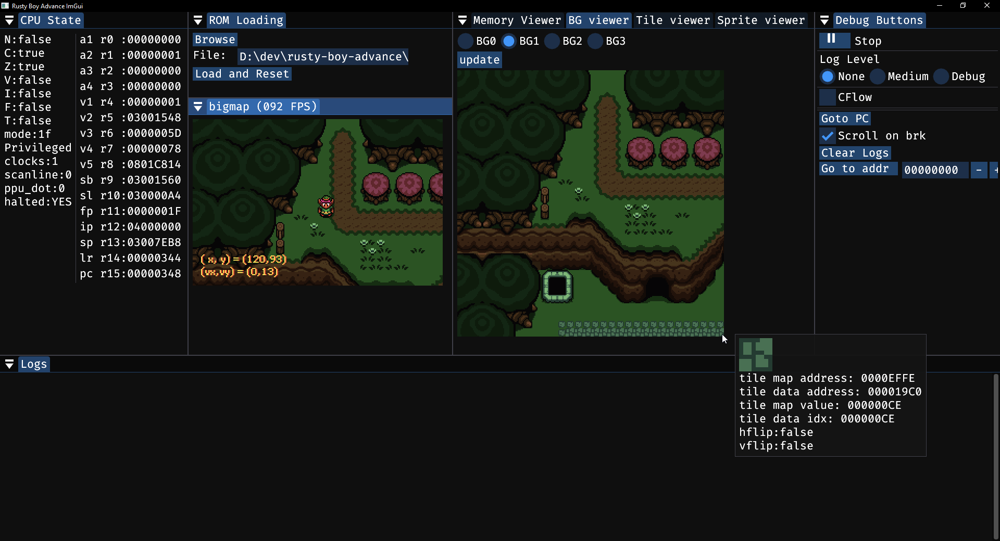
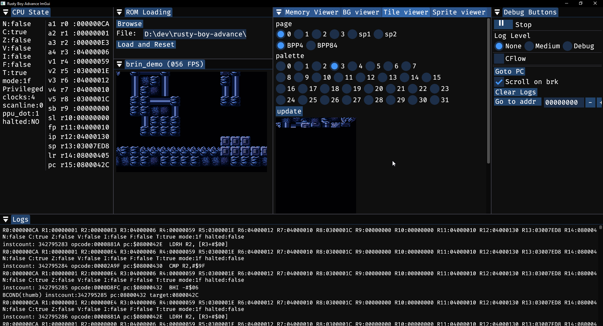
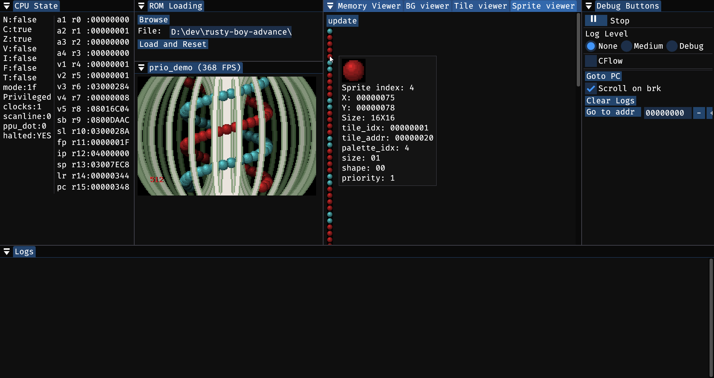

# Rusty Boy Advance

**_[docs](https://nico-abram.github.io/rusty-boy-advance/doc/rusty_boy_advance/)_**

An attempt at a Game Boy Advance emulator in rust (Very much a WIP).

# Progress

It can currently run some simple games, like Kirby Nightmare in Dreamland and Pokemon Mystery Dungeon, most of the tonc demos (With varying levels of correctness) and passes all of the armwrestler tests. It recently became able to boot Pokemon Ruby with lots of visual artifacts.

The CPU interpreter should have all the necessary instructions implemented.

Basic functionality that is missing:

- BG mode 1 and 2 are not implemented at all (These have rotated backgrounds)
- Affine sprites are not implemented at all
- DMA's are very incomplete (Immediate DMAs should work, but triggering DMAs on hblank/vblank is not implemented)
- Timing has not been tested at all, and is missing a lot of functionality (wait states, and the ROM prefetcher)
- Timers are no implemented
- Open bus behaviour is not implemented
- Game pak SRAM is not implemented
- Saves and save states are not implemented
- Sound is not implemented
- The disassembly is incomplete, mostly for the 32bit instructions. 16bit thumb disassembly is close to complete
- Performance has not been optimized much at all

Possible future directions:

- Implement a cached interpreter
- Detect spin loops and don't execute them instruction by instruction
- Improve memory accesses. Currently it uses a u8 byte array and most accesses go through a single read_byte function. Using a properly aligned array, we should be able to perform a single 32bit read for 32bit reads instead of 4 8bit reads. Maybe use a macro to avoid duplicating the address space match statement?
- Make a better wasm frontend (Prettier webpage, possibly add debug tooling/output)

# Screenshots

# Useful references and tools

- [GBATEK](http://problemkaputt.de/gbatek.htm)
- The [arm7TDMI manual](http://infocenter.arm.com/help/topic/com.arm.doc.ddi0210c/DDI0210B.pdf) and the [technical manual](https://documentation-service.arm.com/static/5e8e1323fd977155116a3129)
- The [emulation development discord](https://discord.gg/26wfbS4)
- [This](https://onlinedisassembler.com/odaweb/) online disassembler that supports armv4t
- [This](http://shell-storm.org/online/Online-Assembler-and-Disassembler/) other online disassembler, which works better (The other one doesnt correctly respect the thumb setting all the time) and also has an assembler, but gets some opcodes wrong (Possibly because it's not specifically armv4)
- [This](https://hexed.it/) online hex editor
- [This](https://github.com/Emu-Docs/Emu-Docs/blob/master/Game%20Boy%20Advance/test_roms/arm_wrestler/armwrestler.gba) cpu test rom called armwrestler.
- [The MGBA blog posts](https://mgba.io/).
- [Tonc](https://www.coranac.com/tonc/text/toc.htm). This is intended for GBA programmers, but contains useful reading material and examples, which have been useful as small and simple ROMs for tests.
- [gbadoc](https://gbadev.net/gbadoc/intro.html)
- [dearimgui](https://github.com/ocornut/imgui)
- [mesen2](https://github.com/SourMesen/Mesen2) is an awesome emulator which has a very complete debugger that can step backwards and has conditional breakpoints. It also has a debug view of tiles, backgrounds and sprites.
